# 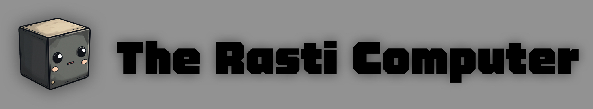

Introducing Rasti, a retro-futuristic laptop inspired by the iconic GRiD Compass and powered by Framework components. It features a 10.4-inch (1600x720) touchscreen, 3D printed enclosure, custom mechanical keyboard, and keycap set tailor-made for this project. 

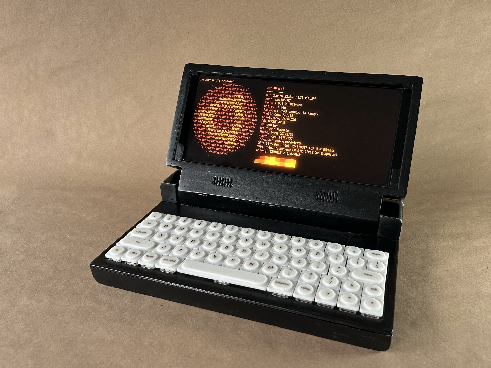

## Enclosure

Blending 80s nostalgia with today's technology, Rasti is not just a statement piece that looks good — it's practical too.

The enclosure, designed for easy printing on a 30x30 cm FDM print bed, captures the essence of the GRiD Compass. After sanding and priming, the surface is finished with Tamiya metallic black paint (TS-40), and a touch of silver dry brushing added the beat-up metal look.

| 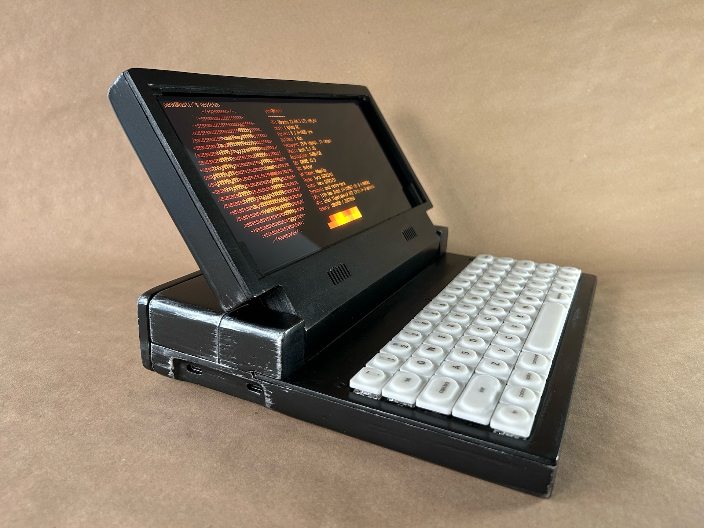 | 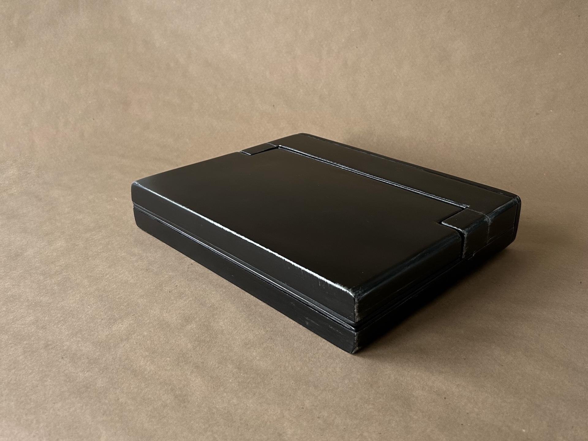 |
| --- | --- |
| 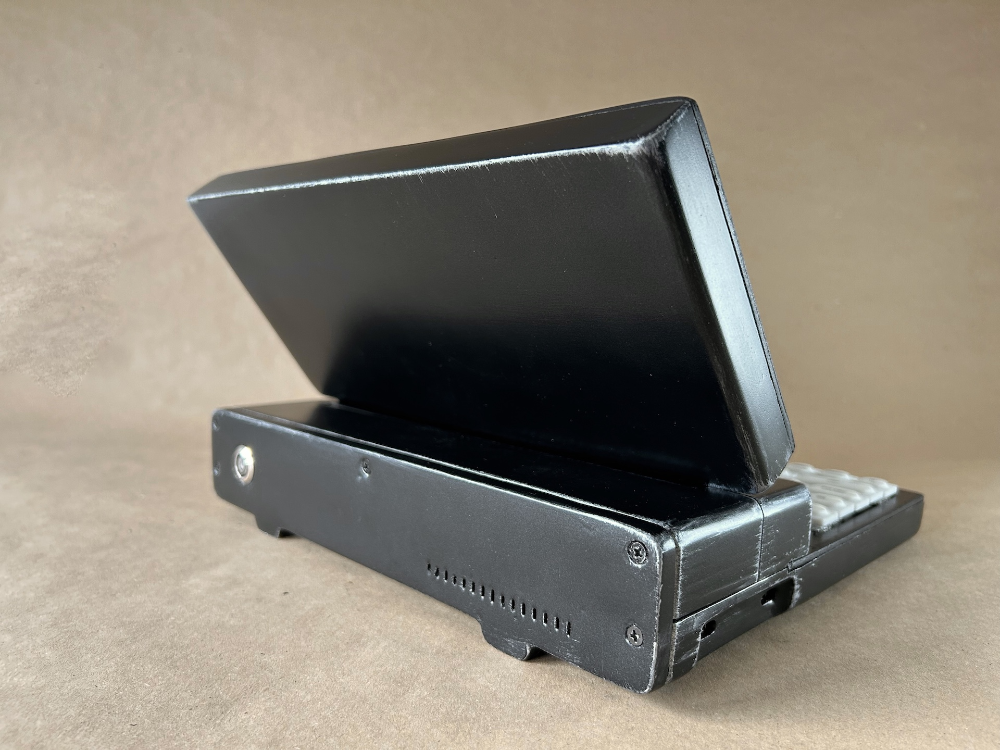 | 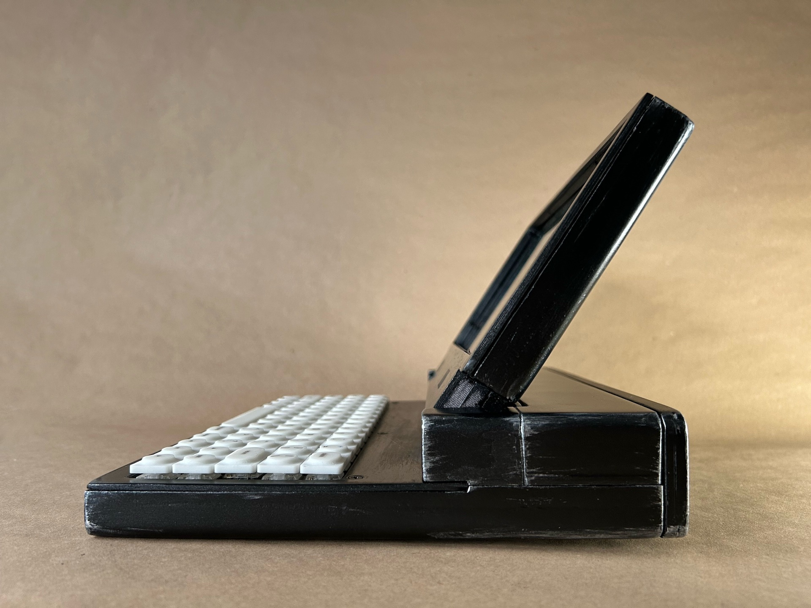 | 

Editable STEP file and 3D printable STL files for the case are available in the `case` directory.

## Keyboard 

Rasti packs a custom mechanical keyboard using Choc Low Profile switches. It's a 64-key staggered layout, powered by a Pi Pico – made specifically for this build. Check the demos: 

- Typing test: [https://twitter.com/penk/status/1752805025099772251](https://twitter.com/penk/status/1752805025099772251)
- The "pencil test": [https://twitter.com/penk/status/1752823049785573749](https://twitter.com/penk/status/1752823049785573749)

| 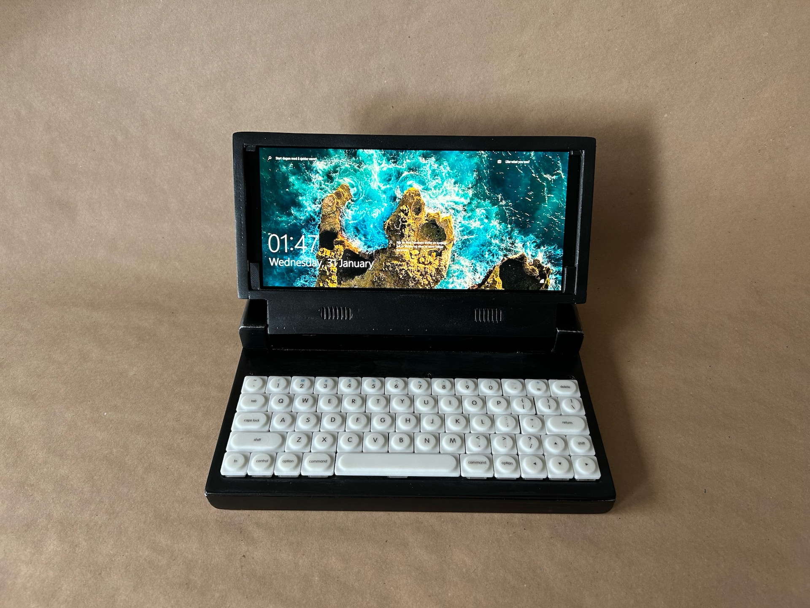 | 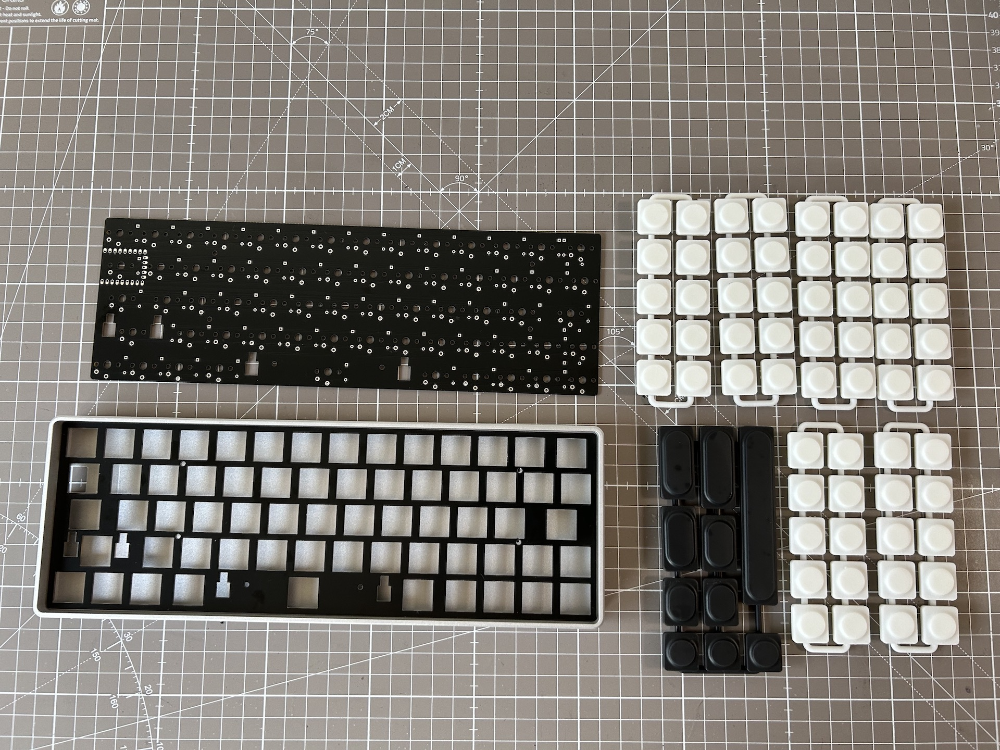 |
| --- | --- |

The Choc-spacing (18mm x 17mm) keycap set was born out of a need for versatility and style. It addresses the limited options for Choc v1 switch modifiers. Designed for SLA resin printing, this set includes sizes ranging from 1U to 2.25U, and a 4.75U spacebar that is compatible with the 6.25U stabilizer. 

We liked the keyboard so much, we made it [its own project](https://github.com/penk/rasti64).

## Electronics 

A 10.4-inch QLED (1600x720) multitouch display is at the centrepiece. It's powered and connected through a USB-C hub and mounted to the chassis with MacBook Pro (A1278) hinges. 

| 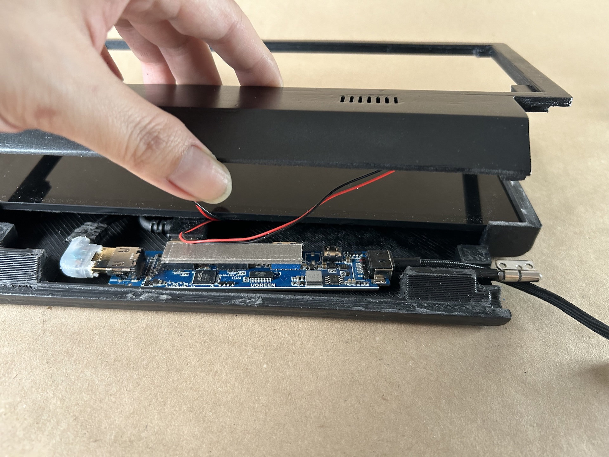 | 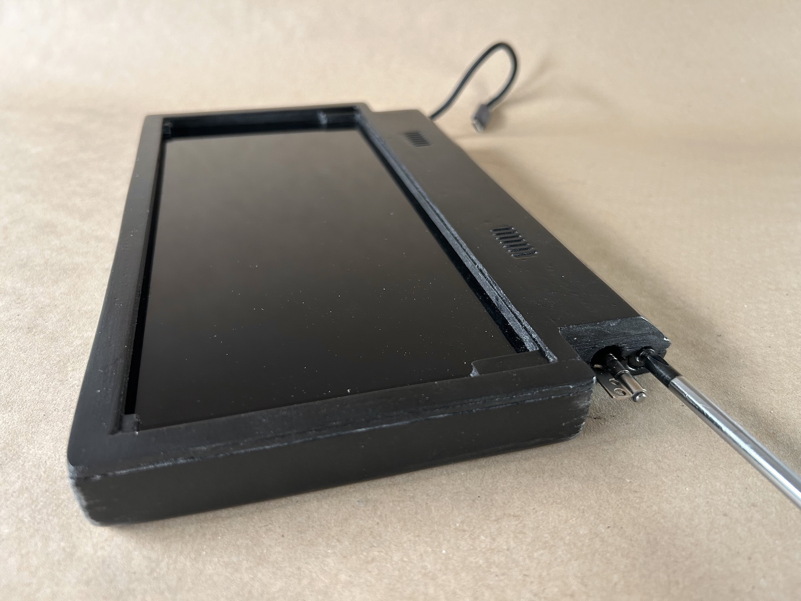 |
| --- | --- |

At the heart of Rasti are Framework's mainboard and battery. Four pins from the keyboard's Pi Pico (`TP1`-`TP3` and `VBUS`) along with two pins from a PC power switch, are directly soldered to the [power button shim](https://www.tindie.com/products/crimier/framework-mainboard-power-button-shim/), then connected to the mainboard. This setup is not only space-efficient, minimizing the overall height, but it also helps in freeing up USB ports for other uses.

The WiFi antenna is attached to the top cover, and then the entire assembly is secured with M3 screws. 

| 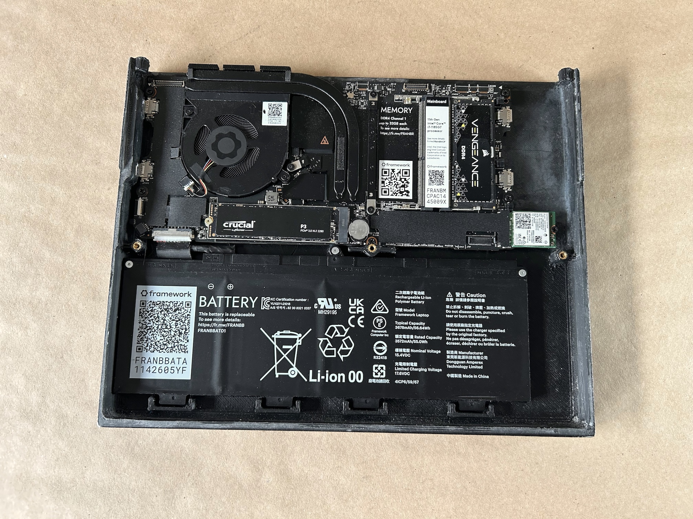 | 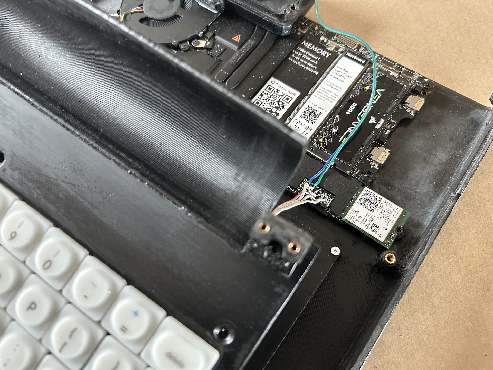 |
| --- | --- |
| 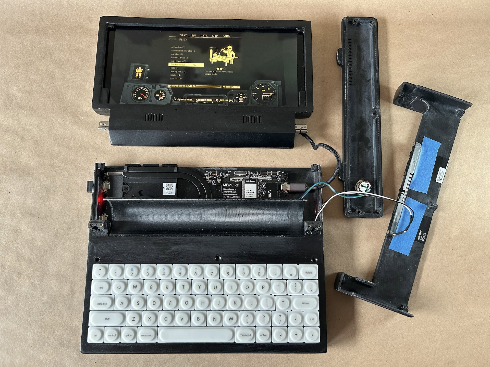 | 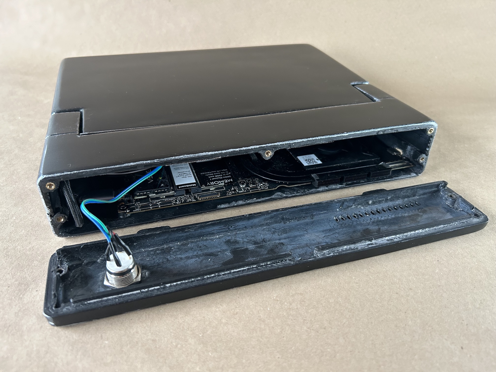 | 

## Bill of Materials (BOM)

### Electronic parts 

Quantity | Item | Notes
--- | --- | ---
1 | Framework 13 Mainboard | [link](https://frame.work/de/en/products/mainboard-11th-gen-intel-core?v=FRANFG000C)
1 | Framework 13 Battery | [link](https://frame.work/de/en/products/battery?v=FRANBBAT01)
1 | Framework WiFi Module | [link](https://frame.work/de/en/products/intel-wi-fi-6e-ax210-no-vpro)
1 | Framework 13 Antenna Module | [link](https://frame.work/de/en/products/antenna-module?v=FRANBA0001)
1 | Waveshare 10.4 QLED Display | [link](https://www.waveshare.com/10.4hp-capqled.htm)
1 | PC Power Switch (16 mm) | [link](https://amazon.de/dp/B09BFWYGJB)
1 | USB-C hub | [link](https://www.amazon.de/-/en/gp/aw/d/B0BR3M8XHK)
1 | Framework Mainboard Power Button Shim | [link](https://www.tindie.com/products/crimier/framework-mainboard-power-button-shim/)

### Keyboard parts 

Quantity | Item | Notes
--- | --- | ---
1 | keyboard PCB | [link](https://github.com/penk/rasti64/blob/master/gerbers/Gerbers-rasti64-pipico.zip) for gerbers 
1 | keyboard plate | [link](https://github.com/penk/rasti64/blob/master/plate/Gerbers-rasti64-plate.zip) for gerbers, must be 1.2 mm PCB thickness
1 | Raspberry Pi Pico 
64 | Kailh Choc V1 PG1350 switches 
64 | 1N4148 diodes | through hole
1 | Kailh Choc Stabilizers | 1x2U and 1x6.25U
2 | 20-Pin Headers or Socket 

### 3D printed parts 

Quantity | Item | Notes
--- | --- | ---
1 | [chassis](case/Rasti-chassis.stl) | FDM print 
1 | [display](case/Rasti-display.stl) | FDM print 
1 | [display-bezel](case/Rasti-display-bezel.stl) | FDM print 
1 | [display-front](case/Rasti-display-front.stl) | FDM print 
1 | [hinge-groove](case/Rasti-hinge-groove.stl) | FDM print 
1 | [keyboard-bracket](case/Rasti-keyboard-bracket.stl) | FDM print 
1 | [keyboard-plate](case/Rasti-keyboard-plate.stl) | FDM print 
1 | [pivot-point-left](case/Rasti-pivot-point-left.stl) | FDM print 
1 | [pivot-point-right](case/Rasti-pivot-point-right.stl) | FDM print 
1 | [rear-cover](case/Rasti-rear-cover.stl) | FDM print 
1 | [top-cover](case/Rasti-top-cover.stl) | FDM print
5 | [keycap-set-1U](https://github.com/penk/rasti64/blob/master/keycaps/Rasti-keycap-set-1U-v1.3.stl) | SLA resin print
2 | [keycap-set](https://github.com/penk/rasti64/blob/master/keycaps/Rasti-keycap-set-V1.4.stl) | SLA resin print 

#### Notes: 
* Pro Tip: Use a 1.0mm nozzle and 0.5mm layer height for faster printing.
* The parts are designed for a 30x30 cm print bed; however, you can split them up using the provided STEP file and print them on a smaller bed (e.g., 25x25 cm).

### Hardware/Fasteners

Quantity | Item | Notes
--- | --- | ---
1 | MacBook Pro (A1278) hinges | [link](https://amazon.de/-/en/gp/product/B086HCD5GK)
7 | M2 threaded insert | M2x4x3.2, [link](https://amazon.de/-/en/dp/B09B7F2XM3)
18 | M2.5 threaded insert | M2.5x4x3.5 
18 | M3 threaded insert | M3x5x5 
4 | M2.5x7 flat-head | hinges 
14 | M2.5x4 flat-head | mainboard and keyboard bracket  
2 | M3x16 flat-head | top cover 
5 | M3x12 flat-head | rear cover
2 | M3x12 flat-head | display 
4 | M3x8 flat-head | display hinge 
5 | M3x10 flat-head | pivot point and keyboard plate 

## Build Instructions 
Coming soon! 

## Copyright and License
Copyright (c) 2024 Penk Chen. All rights reserved.

All files are licensed under the MIT license, see the [LICENSE](LICENSE) for more information.
